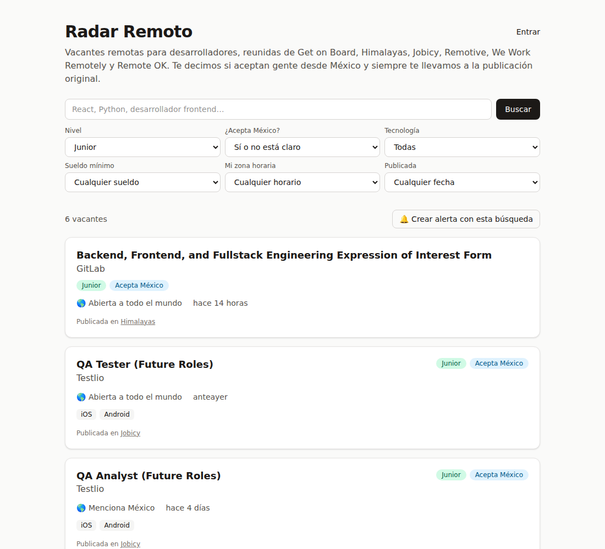
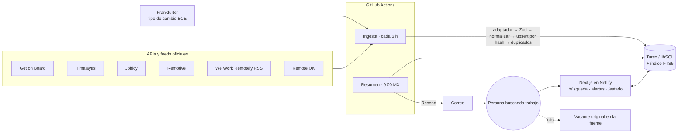

# Radar Remoto

**Vacantes remotas para desarrolladores junior que de verdad aceptan gente de Latinoamérica.**
Reunidas de seis bolsas de trabajo, limpias, sin duplicados y con alertas por correo.

🇺🇸 [Read in English](README.md) · 🌐 App: _https://TU-SITIO.netlify.app_ (ver [guía de deploy](docs/deploy.md)) · 📊 [Estado del sistema](https://TU-SITIO.netlify.app/estado)



## Qué problema resuelve

Las vacantes remotas junior están dispersas en muchas bolsas y mal etiquetadas: buscas "junior remoto" y salen
puestos senior, o "remoto" resulta ser "solo Estados Unidos". Cada bolsa escribe sueldo, ubicación y nivel a su
manera, y la misma vacante aparece en varias.

Radar Remoto junta vacantes de APIs y feeds oficiales, las normaliza a un esquema común, responde
**"¿puede aplicar alguien desde México?"** con la razón de cada respuesta, detecta el nivel, une duplicados y te
manda por correo las nuevas cada mañana.

## Funciones

- **6 fuentes, un esquema**: Get on Board, Himalayas, Jobicy, Remotive, We Work Remotely (RSS) y Remote OK. Un
  adaptador por fuente validado con Zod. Ingesta cada 6 h en GitHub Actions, idempotente, con registro de cada
  corrida y límites de uso por fuente tomados de sus términos.
- **Limpieza de datos de verdad**: sueldos en texto (`"$35,3k- $52k"`, `"USD 1,500/mes"`) → mensual en USD (y
  MXN con el tipo de cambio diario del BCE); ubicaciones y zonas horarias en texto libre (`"LATAM"`,
  `"UTC-3 to UTC-8"`, `"USA, Canada"`) → sí / no / no está claro para México; reparación de texto mal codificado;
  tecnologías canónicas.
- **Duplicados entre fuentes** con similitud por trigramas compatible con pg_trgm.
- **Clasificador junior medido**: reglas explicables + herramienta de etiquetado + precisión y recall.
- **Búsqueda**: FTS5 de SQLite, sin importar acentos, con más peso al título; filtros por nivel, México,
  tecnología, sueldo mínimo, zona horaria y fecha, todos en la URL.
- **Alertas por correo**: entrar sin contraseña, búsquedas guardadas, resumen diario a las 9:00 (hora de México)
  sin repetir vacantes y baja en un clic.
- **Página de estado pública** y **métricas sin cookies**.

## Stack

| Capa          | Elección                                                     | Por qué                                                                                                 |
| ------------- | ------------------------------------------------------------ | ------------------------------------------------------------------------------------------------------- |
| App           | Next.js 16 (App Router), TypeScript estricto, Tailwind CSS 4 | Frontend y backend en un solo deploy; Server Components y Server Actions mantienen las páginas ligeras. |
| Base de datos | **Turso** (libSQL/SQLite) + migraciones con Drizzle          | Plan gratuito generoso y sin mantenimiento. Trade-off abajo.                                            |
| Validación    | Zod                                                          | Cada respuesta de API y cada vacante mapeada se valida: los datos malos fallan en vez de guardarse.     |
| Correo        | Resend (API HTTP)                                            | Plan gratuito (100/día), sin SDK.                                                                       |
| Tareas y CI   | GitHub Actions                                               | Ingesta, resumen diario, actualización de fixtures y CI con Playwright. Logs públicos.                  |
| Hosting       | Netlify                                                      | Plan gratuito con soporte para Next.js.                                                                 |
| Tests         | Vitest, Playwright                                           | Unitarios e integración sobre SQLite real; end-to-end sobre el build de producción.                     |

## Arquitectura



## Decisiones técnicas y sus trade-offs

- **Turso (SQLite) en vez de PostgreSQL.** Gratis y sin mantenimiento, y los tests corren sobre un archivo
  SQLite temporal con las migraciones reales, sin Docker. El costo: no hay `pg_trgm` ni búsqueda full-text en
  español. Por eso:
  - **Duplicados**: la similitud por trigramas está reimplementada en TypeScript con la misma definición que
    pg_trgm, comparando solo dentro de la misma empresa normalizada, y con una regla para que "Junior X" y
    "Senior X" nunca se unan. Los duplicados se marcan (`canonical_job_id`), no se borran: un error se corrige
    fácil y cada fuente conserva su link ("también en…").
  - **Búsqueda**: FTS5 con `remove_diacritics`, más un recortador de sufijos y búsqueda por prefijo para suplir
    la falta de stemming en español ("desarrolladora" encuentra "desarrollador"). Lo que escribe el usuario
    siempre va entre comillas, así que no puede inyectar sintaxis de FTS5.
- **Los adaptadores solo mapean; la limpieza vive en un solo lugar.** Agregar una fuente es mapear campos. El
  hash de contenido incluye una `NORMALIZER_VERSION`: si cambian las reglas, la siguiente corrida reprocesa todo.
- **"No está claro" es una respuesta válida.** "North America" puede incluir o no a México según quién lo
  escriba, así que el detector lo dice en vez de adivinar. Cada respuesta guarda su razón en español.
- **Leer los términos cambió el producto**: los links usan `rel="noopener"` sin `noreferrer` ni `nofollow`
  (Remote OK pide links "follow" y las fuentes deben ver nuestro tráfico); las vacantes de Remotive nunca van en
  correos y nada requiere cuenta (sus términos prohíben usar vacantes para juntar registros); sin JSON-LD
  `JobPosting` (Himalayas y Remotive prohíben mandarlas a Google Jobs); los límites de uso por fuente (Remotive:
  4 al día; Jobicy: una vez por hora) se hacen cumplir desde el registro de corridas. Detalle en
  [docs/sources.md](docs/sources.md).
- **Magic link propio en vez de Auth.js** (v5 sigue en beta): unas 150 líneas con tests. Tokens y sesiones se
  guardan hasheados; el link del correo abre una página de confirmación (POST) para que los escáneres de correo
  no "gasten" el token de un solo uso; máximo 3 links por correo cada 15 min para cuidar la cuota.
- **El resumen diario es idempotente**: cada (alerta, vacante) se registra solo después de enviar el correo; si
  falla, se reintenta mañana, y una segunda corrida no manda nada. México no tiene horario de verano desde 2022,
  así que `0 15 * * *` es siempre las 9:00.
- **Fixtures reales sin acceso a internet**: el entorno de desarrollo no llegaba a las APIs, así que un workflow
  manual baja una respuesta pequeña de cada fuente desde GitHub y la guarda. Los tests nunca usan la red.
- **Métricas sin cookies**: los clics en el sitio se cuentan con `sendBeacon` (los links siguen directos a la
  fuente); los de los correos pasan por `/r/:id`. Solo se guarda vacante, canal y hora.

## Resultados del clasificador

Set etiquetado a mano: **pendiente — 200 vacantes por etiquetar** (ver "Medir el clasificador"). La tabla la
genera `npm run eval` en [docs/classifier-results.md](docs/classifier-results.md).

| Pregunta                             |   Precisión |      Recall |
| ------------------------------------ | ----------: | ----------: |
| ¿Es junior?                          | _pendiente_ | _pendiente_ |
| ¿Puede aplicar alguien desde México? | _pendiente_ | _pendiente_ |

## Correrlo localmente

Requisitos: Node.js 22.

```bash
npm install
cp .env.example .env.local   # todo es opcional en local
npm run db:migrate           # archivo SQLite local (file:local.db) si no hay TURSO_DATABASE_URL
npm run db:seed              # carga las respuestas reales guardadas (sin internet)
# o: npm run ingest          # trae datos en vivo de las fuentes
npm run dev                  # http://localhost:3000
```

Sin `RESEND_API_KEY`, los correos (links para entrar, resúmenes) se guardan en `.outbox/` en vez de enviarse.
`npm run digest` corre el resumen diario a mano.

## Tests

```bash
npm run lint && npm run typecheck
npm test                     # 200+ tests unitarios y de integración, sin internet
npm run build
npx playwright install chromium
npm run test:e2e             # búsqueda, filtros, alertas con magic link, etiquetado, estado, páginas SEO
```

El CI (`.github/workflows/ci.yml`) corre todo esto en cada push y pull request.

## Medir el clasificador

```bash
# .env.local: ADMIN_TOKEN=<16+ caracteres aleatorios>
npm run dev                  # abre /admin y entra con el token
# etiqueta en /admin/etiquetar: 1/2/3/0 = nivel, s/n/u = México, Enter = guardar, Esc = saltar
npm run labels:export        # congela las etiquetas en data/labeled-jobs.json
npm run eval                 # precisión, recall, F1 y matrices → docs/classifier-results.md
```

Mientras etiquetas no se muestra la predicción, para que no sesgue las etiquetas.

## Deploy

Solo planes gratuitos: Netlify + Turso + Resend + GitHub Actions. Paso a paso: [docs/deploy.md](docs/deploy.md).

## Cómo usé IA

Construí esto con **Claude Code** como pair programmer.

- **Claude Code**: propuso el plan por fases; escribió la mayor parte del código y de los tests; leyó la
  documentación y los términos de cada fuente (y encontró las cláusulas que cambiaron el producto); armó el
  workflow de fixtures cuando el entorno no llegaba a las APIs; encontró problemas en los datos reales (texto mal
  codificado, etiquetas basura, el `+14` de Himalayas, ubicaciones sin expandir de Get on Board); corrió lint,
  tipos, tests y CI en cada fase.
- **Mis decisiones**: el problema y el alcance; Netlify en vez de Vercel; Turso en vez de Postgres, sabiendo que
  implicaba reemplazar `pg_trgm` y el full-text de Postgres; GitHub Actions para las tareas programadas; revisar
  la lista de pruebas manuales de cada fase; etiquetar a mano el set de evaluación.
- **Qué revisé o corregí**: _(Marvin: agrega 2 o 3 ejemplos concretos con tus palabras antes de compartirlo.)_

## Atribución de datos

Los datos de las vacantes pertenecen a cada fuente y siempre se muestran con atribución y link a la
publicación original.
