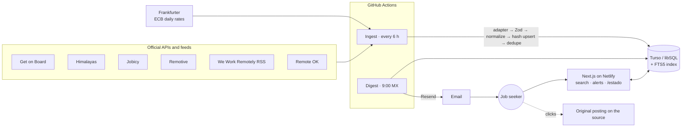

# Radar Remoto

**Remote junior developer jobs that actually accept people from Latin America.**
Aggregated from six job boards, cleaned up, deduplicated, and delivered by email. UI in Spanish.

🇪🇸 [Leer en español](README.es.md) · 🌐 App: _https://YOUR-SITE.netlify.app_ (see [deploy guide](docs/deploy.md)) · 📊 [System status](https://YOUR-SITE.netlify.app/estado)


## The problem

Remote junior jobs are scattered across many boards and badly labeled: search "junior remote" and you get
senior roles, or "remote" turns out to mean "US only". Every board writes salary, location and level
differently, and the same job shows up on several of them.

Radar Remoto collects jobs from official APIs and feeds, normalizes them to one schema, answers
**"can someone in Mexico apply?"** with a reason for every answer, detects the level, merges duplicates,
and emails you new matches every morning.

## Features

- **6 sources, one schema**: Get on Board, Himalayas, Jobicy, Remotive, We Work Remotely (RSS), Remote OK.
  One adapter per source, validated with Zod. Ingestion every 6 h on GitHub Actions, idempotent, with a log of
  every run and per-source rate budgets taken from each source's terms.
- **Real data cleaning**: salary text (`"$35,3k- $52k"`, `"USD 1,500/mes"`) → monthly USD (and MXN with the
  ECB's daily rate); free-text locations and time zones (`"LATAM"`, `"UTC-3 to UTC-8"`, `"USA, Canada"`) →
  yes / no / unclear for Mexico; mojibake repair; tech canonicalization.
- **Cross-source duplicates** with pg_trgm-compatible trigram similarity.
- **Measured junior classifier**: explainable rules + a hand-labeling tool + precision/recall.
- **Search**: SQLite FTS5, accent-insensitive, title-weighted; filters for level, Mexico, technology,
  minimum salary, time zone and date, all in the URL.
- **Email alerts**: passwordless sign-in, saved searches, daily digest at 9:00 Mexico City time, never
  repeating a job, one-click unsubscribe.
- **Public status page** and **cookieless impact metrics**.

## Stack

| Layer           | Choice                                                     | Why                                                                                                    |
| --------------- | ---------------------------------------------------------- | ------------------------------------------------------------------------------------------------------ |
| App             | Next.js 16 (App Router), TypeScript strict, Tailwind CSS 4 | Frontend and backend in one deployable; Server Components and Server Actions keep most pages JS-light. |
| Database        | **Turso** (libSQL/SQLite) + Drizzle ORM migrations         | Generous free tier, zero-ops. Trade-off below.                                                         |
| Validation      | Zod                                                        | Every API response and every mapped job is validated: bad data fails loudly instead of being stored.   |
| Email           | Resend (plain HTTP API)                                    | Free tier (100/day), no SDK needed.                                                                    |
| Scheduling & CI | GitHub Actions                                             | Ingestion, daily digest, fixture refresh, CI with Playwright. Public logs.                             |
| Hosting         | Netlify                                                    | Free tier with Next.js support.                                                                        |
| Tests           | Vitest, Playwright                                         | Unit + integration on real SQLite files, end-to-end on a production build.                             |

## Architecture



Pipeline for each source (`src/lib/ingest`): fetch politely (sequential, delays, retries with backoff,
rate budget) → `parsePage` → `mapJob` to the common `SourceJob` schema → `normalizeJob` (tech-role filter,
seniority, Mexico eligibility, salary, technologies) → content-hash upsert (insert / update / unchanged)
→ run log. After all sources: FX rates and cross-source dedupe.

## Technical decisions and trade-offs

- **Turso (SQLite) instead of PostgreSQL.** Free and zero-ops, and tests run on a temporary SQLite file
  with real migrations, no Docker. Cost: no `pg_trgm` and no Spanish full-text search. So:
  - **Duplicates**: trigram similarity re-implemented in TypeScript with pg_trgm's exact definition, compared
    only within the same normalized company ("blocking"), with a guard so "Junior X" and "Senior X" never merge.
    Duplicates are marked (`canonical_job_id`), never deleted: a wrong match is easy to undo and every source
    keeps its link ("también en…").
  - **Search**: FTS5 with `remove_diacritics`, plus a light suffix trimmer and prefix matching to make up for
    the missing Spanish stemmer ("desarrolladora" finds "desarrollador"). User input is always quoted, so it
    can't inject FTS5 syntax.
- **Adapters only map; normalization lives in one place.** Adding a source is mapping fields. The content hash
  covers the source data plus a `NORMALIZER_VERSION`: bumping it re-normalizes everything on the next run;
  daily exchange-rate changes don't count as "the job changed".
- **"Unclear" is a valid answer.** "North America" may or may not include Mexico depending on who wrote it, so
  the detector says so instead of guessing. Every answer stores a Spanish reason shown in the UI.
- **Reading the terms changed the product**: links use `rel="noopener"` without `noreferrer`/`nofollow`
  (Remote OK asks for followed links and sources should see our traffic); Remotive jobs are never emailed and
  nothing requires an account (their terms forbid using listings to collect signups); no `JobPosting` JSON-LD
  (Himalayas and Remotive forbid submitting to Google Jobs); per-source request budgets (Remotive: 4/day,
  Jobicy: once per hour) are enforced from the run log. Details in [docs/sources.md](docs/sources.md).
- **Own magic-link auth instead of Auth.js** (still beta for v5): ~150 tested lines. Tokens and sessions are
  stored hashed; the emailed link opens a confirm page (POST) so email scanners that prefetch links can't
  burn the single-use token; 3 links per email per 15 min to protect the email quota.
- **Daily digest is idempotent**: deliveries are recorded per (alert, job) only after the email is sent;
  a failure retries tomorrow, a second run sends nothing. Mexico has no DST since 2022, so `0 15 * * *` is
  9:00 year-round.
- **Real fixtures without network access**: the dev sandbox couldn't reach the APIs, so a manual workflow
  downloads one small response per source from GitHub's runners and commits it. Tests never hit the network;
  a contract test runs every adapter over every saved response.
- **Cookieless metrics**: clicks on the site are counted with `sendBeacon` (links stay direct to the source);
  links in emails go through `/r/:id`. Only job, channel and time are stored.

## Classifier results

Hand-labeled set: **pending — 200 jobs to label** (see "Measuring the classifier" below). The table is
generated by `npm run eval` into [docs/classifier-results.md](docs/classifier-results.md).

| Question                     | Precision |    Recall |
| ---------------------------- | --------: | --------: |
| Is it junior?                | _pending_ | _pending_ |
| Can someone in Mexico apply? | _pending_ | _pending_ |

## Run locally

Requirements: Node.js 22.

```bash
npm install
cp .env.example .env.local   # every value is optional locally
npm run db:migrate           # local SQLite file (file:local.db) unless TURSO_DATABASE_URL is set
npm run db:seed              # load the saved real API responses (offline)
# or: npm run ingest         # fetch live data from the sources
npm run dev                  # http://localhost:3000
```

Without `RESEND_API_KEY`, emails (sign-in links, digests) are written to `.outbox/` instead of being sent.
`npm run digest` runs the daily email by hand.

## Tests

```bash
npm run lint && npm run typecheck
npm test                     # 200+ unit and integration tests, offline (real SQLite files, real fixtures)
npm run build
npx playwright install chromium
npm run test:e2e             # search, filters, alerts with magic link, labeling, status, SEO pages
```

CI (`.github/workflows/ci.yml`) runs all of the above on every push and pull request.

## Measuring the classifier

```bash
# .env.local: ADMIN_TOKEN=<16+ random chars>
npm run dev                  # open /admin, sign in with the token
# label at /admin/etiquetar: 1/2/3/0 = level, s/n/u = Mexico, Enter = save, Esc = skip
npm run labels:export        # freezes the labels into data/labeled-jobs.json
npm run eval                 # precision/recall/F1 + confusion matrices → docs/classifier-results.md
```

The classifier's prediction is hidden while labeling so it can't bias the labels.

## Deploy

Free tiers only: Netlify + Turso + Resend + GitHub Actions. Step by step: [docs/deploy.md](docs/deploy.md).

## How I used AI

I built this with **Claude Code** as a pair programmer.

- **Claude Code**: proposed the phased plan; wrote most of the code and tests; read each source's docs and terms
  (and found the clauses that shaped the product); set up the fixture-refresh workflow when the sandbox couldn't
  reach the APIs; found data problems in real responses (mojibake, spammy tags, Himalayas' `+14` offset, Get on
  Board's unexpanded locations); ran lint, type checks, tests and CI on every phase.
- **My decisions**: the problem and scope; Netlify instead of Vercel; Turso instead of Postgres — knowing it meant
  replacing `pg_trgm` and Postgres full-text search; GitHub Actions for scheduling; reviewing each phase's
  manual-testing checklist; labeling the evaluation set by hand.
- **What I reviewed or corrected**: _(Marvin: add 2–3 concrete examples in your own words before sharing this.)_

## Data attribution

Job data belongs to each source and is always shown with attribution and a link to the original posting.
